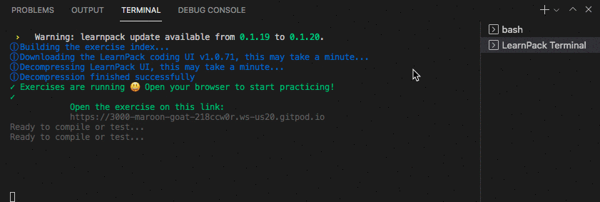

# `01` New Terminal

Este motor de ejercicios hace uso de tu terminal, eso significa que no puedes escribir en el terminal actual en la parte inferior de tu pantalla.

## 📝 Instrucciones:

1. Para poder completar este tutorial, tienes que abrir un nuevo terminal. Eso lo puedes hacer dándole *clic* en el menú estilo hamburguesa en la parte superior izquierda de tu pantalla y eligiendo la opción:

```bash
menu => Terminal => Nuevo terminal
```


## 💡 Pista:

+ Tienes una lista de todos los terminales abiertos en la parte inferior derecha de tu pantalla, siempre puedes cambiar entre terminales o crear nuevos.


