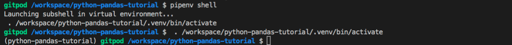

# `01.2` Pipenv

Before starting any Python project, it's always a good idea to create a new environment. An isolated Python environment prevents bugs and makes your application independent.

We are using `pipenv` as our package and environment manager.

## 📝 Instructions:

1. Create a new environment. Type the following in your terminal:

```bash
$ pipenv shell
```

## 💻 Expected Result:

Read the command line output, it should say "Launching subshell...." and no error should be visible.



## 💡 Hints:

+ Do not include the `$` symbol.

+ Every time you open a new terminal (a.k.a.: command line), you will have to enter into the environment again by typing `pipenv shell`.
