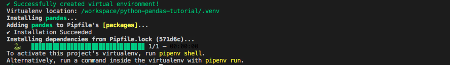

# `02` Install

Let's kick off our environment by installing Pandas.

Over the internet, you will find the `pip` command being used to install Python packages. We prefer to use [pipenv](https://pipenv.pypa.io/en/latest/) as it provides more functionality and avoids future maintenance headaches by combining [pip](https://pip.pypa.io/en/stable/) and [virtual env](https://virtualenv.pypa.io/en/latest/) libraries.

## 📝 Instructions:

1. Please, type the following command in the terminal:

```bash
$ pipenv install pandas
```
## 💡 Hint:

+ You should see in your terminal an output like this:



## 🔎 Important:

+ Remember, you have to be inside the environment shell from now on.
