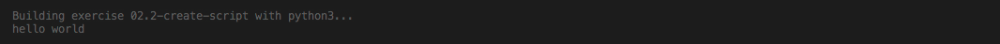

# `02.1` Create a Script

Python is a scripting language, meaning that to run a Python code, you don't need to compile; all you have to do is create a file with the `.py` extension and run it by using `python name_of_file.py`.

Let's create our first Python script.

## 📝 Instructions:

1. Create a new `app.py` file in the root of the project. (Make sure you are at the root).

2. Add the code to print `Hello World` on the terminal using the `print` function.

```py
print("Hello World")
```

3. Run your Python script by typing on the terminal `$ python app.py`.

## 💻 Expected Result:

After you run the command, you should see something like this:



## 💡 Hints:

+ Your `app.py` file must be next to the `.gitignore`, `learn.json` or `Pipfile` files.
  
+ You can also create the file using the terminal command: `$ touch app.py` and open it by double-clicking on the file name or typing `$ code app.py`.
