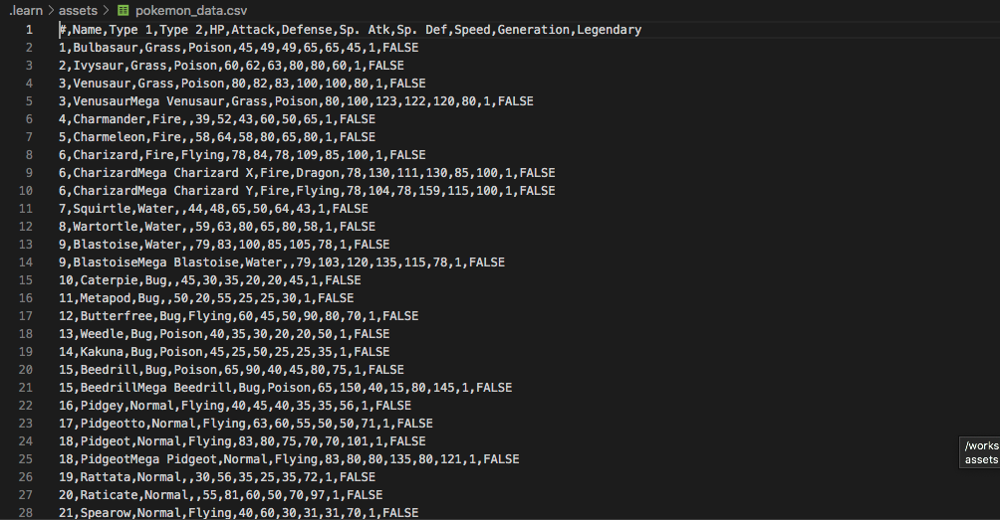

# `03` Datasets

En Machine Learning los "Datasets" son los datos que utilizamos para nuestros experimentos. Por lo general, alimentamos estos Datasets a "modelos" y experimentamos de diferentes maneras, el objetivo siempre es predecir algo.

Posibles Datasets basados en tu predicción objetiva:

- Si vendemos zapatos, ¿Cuántos zapatos necesito en mi almacén para el próximo mes? Un buen Dataset serán las ventas de los últimos 2 años.

- Si estamos construyendo un programa para diagnosticar neumonía, un buen Dataset serán 100 radiografías con neumonía y 100 radiografías sin neumonía.

Tienes que ser creativo al crear tus Datasets, piensa en todas las variables que afectan la predicción y trata de recolectar y organizar todo en uno o varios Datasets. 

Este proyecto ya viene con un Dataset de Pokémon, ubicado en la ruta: `./.learn/assets/pokemon_data.csv`.

## 📝 Instrucciones:

1. Puedes abrir el archivo manualmente o corriendo el siguiente comando en tu terminal: 

```bash
$ code ./.learn/assets/pokemon_data.csv
```

## 💡 Pista:

Después de abrir el archivo, verás algo como esto:



Como puedes ver, los datos están representados en un archivo CSV donde cada fila es un pokemón diferente con su propio ID, Nombre, Tipo, HP, Ataque, etc.

Por favor has clic en  `next ->` y ve al siguiente paso del ejercicio.