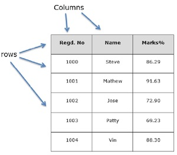

# `08` Pandas Data Frame

DataFrame is just a fancy word for "table" or "tabulated data". You can create DataFrame from any dataset.




You can manually create a DataFrame with the following code:

```python
import pandas as pd
# two dimensional array of name,age values.
data = [['Alex',10],['Bob',12],['Clarke',13]]

# create the dataframe and name the columns
df = pd.DataFrame(data,columns=['Name','Age'])

# print the dataframe
print(df)
```

## 📝 Instructions

Please create a dataframe with the following data, the column labels will be: `Brand, Make, Color`

```python
data = [["Toyota", "Corolla", "Blue"], ["Ford", "K", "Yellow"], ["Porche", "Cayenne", "White"]]
```

## 💻 Expected output

```
    Brand     Make   Color
0  Toyota  Corolla    Blue
1    Ford        K  Yellow
2  Porche  Cayenne   White
```