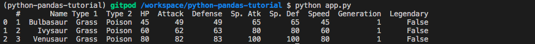

# `05.3` DataFrame Head 

As you can see from the previous step, Pandas makes an effort to display the Dataset in the cleanest way possible, easy to read and understand.

But Pandas also offers other methods to simplify data visualization, let's start with the `head()` function.

## 📝 Instructions:

1. Use the same DataFrame variable you used in the previous exercise.

2. Use the `DataFrame.head` function to print only the first **three** rows of the Dataset (`DataFrame`).

## 💻 Expected Result:

Your terminal output should look like this:

## 💡 Hint: 

+ Read the `dataframe.head` documentation [here](https://pandas.pydata.org/docs/reference/api/pandas.DataFrame.head.html#pandas-dataframe-head) to learn how to use it.
