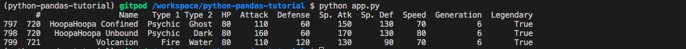

# `05.4` Dataframe Tail

We can also import the last 3 items if we want, but using the `tail` function.

## 📝 Instructions:

- Use the `data_frame.tail` function to print just the last **three** rows of the Dataset.

## Expected Result:

As you can see, the first column that represents the index, now instead of 1,2,3 it has the elements 797,798,799.

## 💡Hint: 

- Read the `dataframe.tail` documentation [here](https://pandas.pydata.org/docs/reference/api/pandas.DataFrame.tail.html) to learn how to use it.
