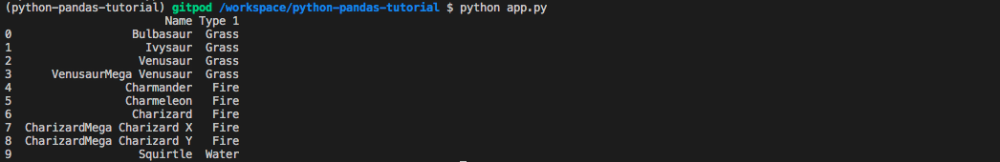

# Print columns

You can also print jsut one collumn of your choice, for example:
```python
print(data_frame['Type 1']) #this will print only the column "Type 1"
```
You can also use the square brackets `[]` to pick the range of rows you want to print like this:

```python
print(data_frame[0:10])
```

Or you can combine both tricks like this:

```python
print(data_frame['Type 1'][0:10])
```

## 📝 Instructions

Print only the columns 'Name' and 'Type' name from your dataset, and only the first 5 elements.


## 💻 Expected output

Your terminal should look like this:



